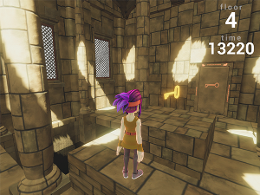
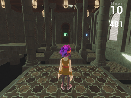
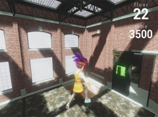
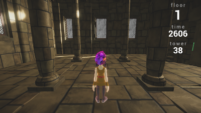
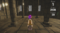

# Obstacle Tower Agent
Obstacle Tower agent represents a software agent trained with *Reinforcement Learning* techniques. Main premise is to tackle challenges of Obstacle Tower environment.  
Environment is created by Unity team and published as a rich 3D environemnt with navigation and generalization in mind.  
This agent is trained with two policy gradient methods, [Proximal Policy Optimization](https://arxiv.org/abs/1707.06347) and [Synchronous Actor Critic](https://arxiv.org/abs/1602.01783). Both methods are combined with [ICM](https://arxiv.org/abs/1808.04355) module.  
  
## Quick start
Requirements: `python 3.5+` and `pip`.
Dependencies are located in `requirements.txt` file. Before dependency installation, turning on the GPU is a **must**, since both *PyTorch* and *Tensorflow* requires *CUDA* and *cuDNN* installed. Check [here](https://docs.nvidia.com/deploy/cuda-compatibility/) for compatibility with your graphic driver and [here](https://docs.nvidia.com/cuda/cuda-installation-guide-linux/index.html) for installation instructions.  
Install dependencies with `pip install -r requirements.txt`. *Note:* Having active virtual environemnt is a recommendation.  
Obstacle Tower environment can be found [here](https://github.com/Unity-Technologies/obstacle-tower-env).
Clone environment and install wrapper via `pip`. Further, download environment itself, unzip it and place it into the root of the project. Detail instructions are at Obstacle Tower Github page.  
## Starting an agent
Running an agent can be achieved with:  
`python3 -m runner --model_name <model_name>`  
This will start inference mode with selected model. Pretrained models are placed in `models/` directory.
To check all available options run `python3 -m runner -h`.  
Agent runs until in-game time runs up.
## Training an agent
Agent training is triggered by running training script: `python3 -m agent.learn`. This will initialize training with default parameters and it will use A2C as a learning method. Run `python3 -m agent.learn -h` to check all options and their description.  
Training can be visualized with *TensorboardX*.  
After initial collection of observation stops and training starts, run `tensorboard --logdir runs/<training_start_timestamp>`. This will start server on `localhost:6006` by default.
## Training details
Successful training of a reinforcement learning agent is a difficult job. It requires a lot of knowledge and implementation tricks such as:
* Observation normalization,
* Advantage normalization,
* Scaling rewards by running reward std,
* Custom network initialization etc.

Next few paragraphs will give you some sense of what to expect from environment and what is base agent module and ICM module.  
### Observation
Observation is given as a tuple of one in-game frame, time left and collected keys. Originally frames are given as RGB picture of size 168x168. Frame is downsized to 84x84 which is classical shape in computer vision based Reinforcement Learning, since it lowers graphic memory requirements.  
One in-game frame takes a small amount of in-game time and using every frame is unnecessary. For that reason `frame-skipping` is used. That means that in *N* consecutive frames we repeat the same action, accumulate rewards and return frame on N-th step.  
 converts to .
### Actions
Available agent actions are:
```
Forward/Backward/No-move
Left/Right/No-move
Turn clockwise/Turn counterclockwise
Jump/No-jump
```
Agent action spaces contains 54 discrete actions if we take all combinations into consideration.
### Rewards
Obstacle Tower is sparse environment which means that agent doesn't receive reward on each action it makes. This makes learning process much slower and harder.  
The agent gets reward only for passing through door. Extrinsic (outer) reward is shaped as, passing through door * percentage of remaining time. This enforces agent to go through door as fast as it can.  
Also intrinsic reward received from ICM module is added to base reward. This intrinsic reward pushes agent to explore environment.
### Base network
State (in-game frame) received from environment is input to our base model. It's passed through couple of convolutional blocks and then transformed with linear layer. State, now as a feature vector, is passed through GRU cells. Recurrent block models sequence of events and here is used to replace frame-stacking. Output of RNN is, passed through one fully-connected layer to receive prediction of an value function and passed through another fully-connected layer with softmax activation to create action probability distribution.  
<p align="center">
	
</p>

### Intrinsic Curiosity Module
ICM module represents a couple of neural network blocks which yield an intrinsic reward. First block is feature extractor, in this case CNN, which receives as an input, current state and a new state. Outcome is feature representation of those states. Next two blocks are, forward model and inverse model. Both models are multi layer perceptrons, where input of the former is action and feature representation of next state and inputs of latter model are feature representations of both current state and next state.  
Outcome is predicted feature representation of a next state and predicted action respectively. Intrinsic reward is calculated as mean square error of next state feature representation and predicted feature representation of a next state. This intrinsic reward is added to base reward to increase agent curiosity and improve exploration.
<p align="center">
  
</p>
